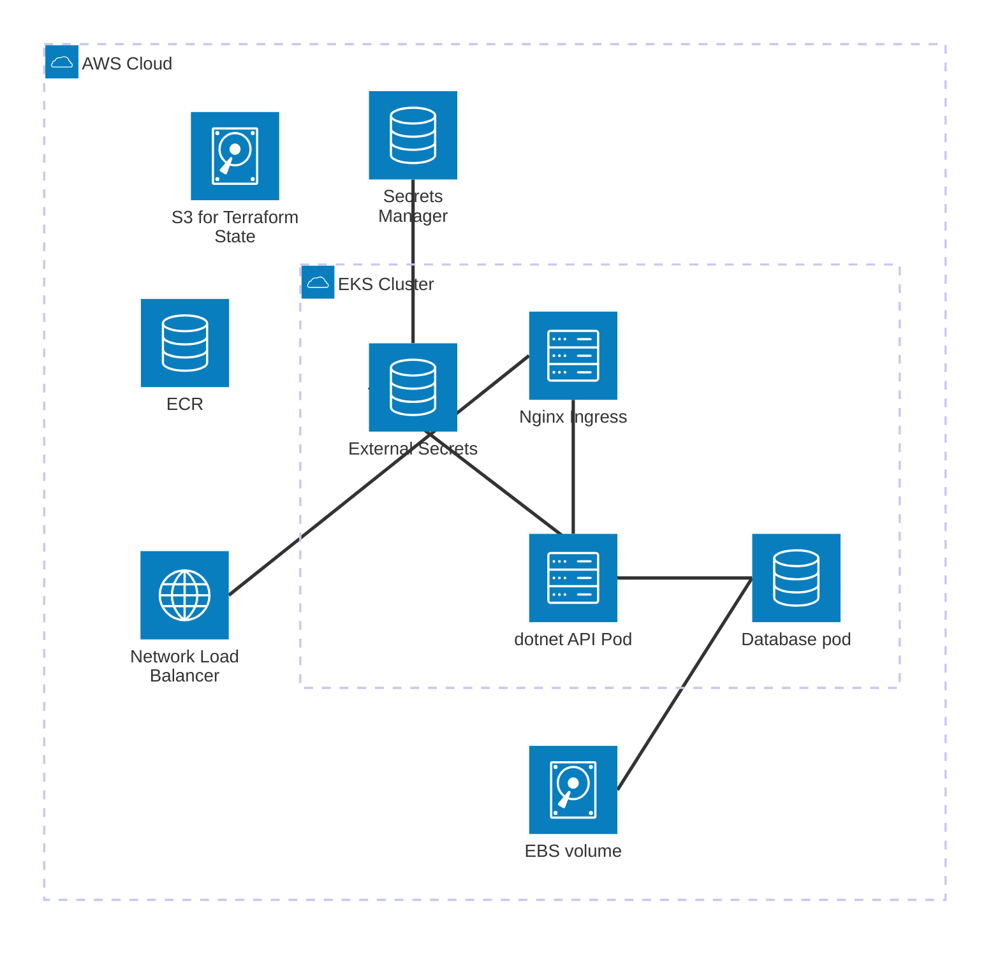
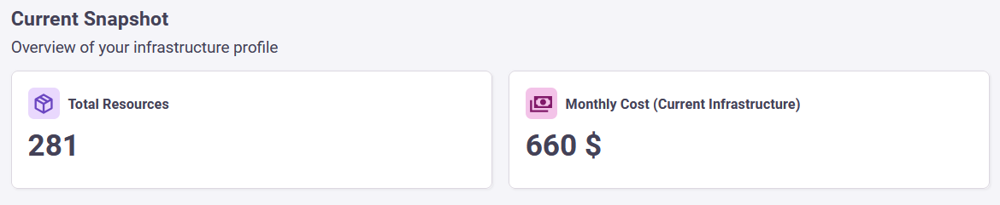

# AWS EKS Infrastructure with Terraform

Infrastructure as Code (IaC) for AWS EKS using Terraform, featuring External Secrets Operator, PostgreSQL, and Jenkins CI/CD.

<!-- TOC -->
* [AWS EKS Infrastructure with Terraform](#aws-eks-infrastructure-with-terraform)
  * [Project overview](#project-overview)
  * [.NET Web API](#net-web-api)
  * [🪣 State file storage](#-state-file-storage)
  * [AWS ECR setup](#aws-ecr-setup)
  * [📦 Infrastructure Modules](#-infrastructure-modules)
    * [🌐 Network module](#-network-module)
    * [☸️ Compute module](#-compute-module)
    * [🔐 Security module](#-security-module)
    * [🗄️ Database module](#-database-module)
    * [🌐 Load-balancing module](#-load-balancing-module)
    * [🧩 App-config module](#-app-config-module)
  * [💰 Cost Management](#-cost-management)
  * [Jenkins pipeline](#jenkins-pipeline)
    * [Pipeline stages](#pipeline-stages)
    * [Post pipeline actions](#post-pipeline-actions)
    * [How to run pipeline](#how-to-run-pipeline)
  * [How to apply infrastructure code](#how-to-apply-infrastructure-code)
    * [Prerequisites](#prerequisites)
    * [Steps](#steps)
  * [Some lessons learned](#some-lessons-learned)
    * [Native state locking support](#native-state-locking-support)
    * [EKS Access](#eks-access)
    * [Helm release syntax](#helm-release-syntax)
    * [EKS Access #2](#eks-access-2)
<!-- TOC -->

## Project overview

This is an Infrastructure-as-Code project to provision resources for a .NET web API.

Global resources:

 - **AWS ECR**

Environment specific resources:

- Network module
  - **AWS VPC**
- Compute module
  - **AWS EKS cluster**
  - IAM role for EKS add-ons
  - EKS access for Jenkins user
- Security module
  - **AWS Secrets Manager secret**
  - Helm release for **External Secrets Operator (ESO)**
  - IAM role and EKS pod identity association for ESO
- Database module
  - Helm release for **PostgreSQL**
  - Kubernetes storage class definition
  - Kubernetes namespace for database
- Load-balancing module
  - Helm release for **NGINX Ingress Controller**
- App-config module
  - Kubernetes namespace for .NET app
  - Kubernetes SecretStore connected to AWS Secrets Manager
  - Kubernetes ExternalSecret

Environments:

- Development
- Test
- Staging
- Production

## .NET Web API

This infrastructure was designed to accommodate the **.NET web API** from the following repository:
https://github.com/balintmolnar/dotnet-webapi.git



*A diagram of the infrastructure made with Mermaid architecture-beta.*

## 🪣 State file storage

The state files are remotely stored in an **encrypted AWS S3 bucket** with **versioning** and **state locking**.

There is a separate state file for each environment (dev, test, staging and prod) and one for the "global" environment.

## AWS ECR setup

The project defines an **AWS Elastic Container Registry** to host container images of the .NET web API. This registry is a shared resource, so its code is placed in a folder called "global", and has its own state file.

## 📦 Infrastructure Modules

I decided to follow a modular architecture to ensure reusability and separation of concerns.

### 🌐 Network module

An **AWS VPC** is installed using the _terraform-aws-modules/vpc/aws_ module. The VPC uses a single NAT gateway to reduce costs, and is decorated with tags that makes the VPC and its subnets identifiable by the AWS EKS.

Subnet CIDR blocks are defined in a way that approx. 4000 IPv4 addresses are assignable in each subnet.

### ☸️ Compute module

An **AWS EKS cluster** is installed using the _terraform-aws-modules/eks/aws_ module.

- Kubernetes version: 1.33
- Worker nodes:
  - an **EKS managed node group** with a max size of 3 nodes

The **AWS-EBS-CSI-Driver** add-on is installed to take care of automatic EBS volume provisioning. To make it work, the following resources are created:

- An IAM role that allows the driver to access the relevant EC2 services.
- A pod identity association to connect the IAM role with the driver's Kubernetes service account
  - this relies on the presence of the EKS-Pod-Identity-Agent add-on

This module installs some EKS settings (an access entry and an access policy association) to make sure that the CI/CD account (jenkins-deployer) has permission to install components into the cluster. 

### 🔐 Security module
 
A password is needed for the database, and that password is stored in an **AWS Secret Manager secret** created by Terraform.

To make the password available as a Kubernetes Secret, the **External Secrets Operator (ESO)** tool is installed by Terraform into the cluster. This tool is given an IAM role and a corresponding pod identity to authorize its Kubernetes service account to talk to the AWS Secrets Manager service, and fetch the password.

The password gets generated by Terraform and is unique for each environment.

### 🗄️ Database module

Terraform installs a **PostgreSQL** database onto the cluster via helm. The DB password is taken from the security module.

A **Kubernetes storage class** gets installed to handle the database's persistent volume claims using the *ebs.csi.aws.com* provisioner.

A dedicated Kubernetes namespace is defined for the database.

### 🌐 Load-balancing module

The load-balancing module defines an **NGINX Ingress Controller** installation, specifying that AWS should provide a **Network Load Balancer**.   

### 🧩 App-config module

The app-config module defines:
- a Kubernetes namespace for the .NET app,
- a Kubernetes SecretStore connected to the AWS Secrets Manager,
- and a Kubernetes ExternalSecret to make the database password available inside the cluster.  

## 💰 Cost Management

Infrastructure costs were analyzed using **Infracost** to ensure visibility into cloud expenditure.

Total estimated monthly cost: 660 $

Monthly baseline costs for the dev environment:

- EKS cluster: 73 $
- Node group: 53 $
- NAT Gateway: 38 $
- KMS key: 1 $
- Secrets Manager secret: 0.40 $




## Jenkins pipeline

A **Jenkinsfile** has been added to the project to support automatic infrastructure provisioning. Jenkins is connected to AWS with the **Pipeline: AWS Steps** plugin using a dedicated AWS user. The pipeline takes the environment (dev, test, etc.) as an input variable.

### Pipeline stages

1. Initialization (`terraform init`)
2. Planning (`terraform plan`)
   1. the output gets saved into a txt file (_tfplan.txt_)
3. Asking for confirmation
   1. If the environment is set to 'prod', Jenkins asks for a manual confirmation before proceeding
4. Execution (`terraform apply`)
   1. A multi-stage apply is configured to prevent dependency issues

### Post pipeline actions

As a post pipeline step, the Terraform plan (_tfplan.txt_) is archived as an artifact.

### How to run pipeline

To run the pipeline, a Jenkins server is needed with the following setup:

- the _Pipeline: AWS Steps_ plugin
- Terraform CLI tool (v1.14+)
- AWS CLI (2.33+)
- AWS account credentials

## How to apply infrastructure code

### Prerequisites

Prerequisites to execute the Terraform project:

- An AWS account
- An S3 bucket for the state files (bucket name needs to be updated in backend)
- AWS CLI tool (2.33+) with configured credentials
- Terraform CLI tool (v1.14+)

### Steps

To set up the AWS ECR:

```
cd global
terraform init
terraform apply
```

To set up the 'dev' environment:

``` 
cd ../environments/dev/
terraform init
terraform apply -var=exclude_secret_store=true
terraform apply
```

## Some lessons learned

### Native state locking support

- **Problem:** An unlocked state file could lead to parallel executions and state file corruption.
- **Solution:** From version 1.10.0, Terraform supports native state locking with AWS S3. The `use_lockfile` parameter had to be set to use it.

### EKS Access

- **Problem:** Jenkins couldn't deploy to the cluster.
- **Root cause:** It didn't have the necessary access permissions to deploy elements to the cluster. 
- **Solution:** The `AmazonEKSAdminPolicy` access policy has been assigned to Jenkins' AWS user via an `aws_eks_access_policy_association` resource (restricted to one namespace).

### Helm release syntax

- **Problem:** Special characters like backslashes made it difficult to set Helm chart values in Terraform.
- **Solution:** The `yamlencode` block solved the problem (see _modules/load-balancing/main.tf_).

### EKS Access #2

- **Problem:**  During a `terraform apply`, execution failed because the _terraform-deployer_ AWS user didn't have permissions to create Kubernetes namespaces or storage classes. Which was strange because the `enable_cluster_creator_admin_permissions` had already been set to true.
- **Root cause:** EKS wasn't quick enough to propagate the access permissions into the Kubernetes RBAC settings. Terraform was notified that the EKS cluster is ready, and tried to install the K8s resources, but its permissions were not yet known to K8s.
- **Solution:** Implemented a `time_sleep` resource of 60 seconds after the EKS cluster is finished, to allow sufficient time for the access permissions to be propagated.